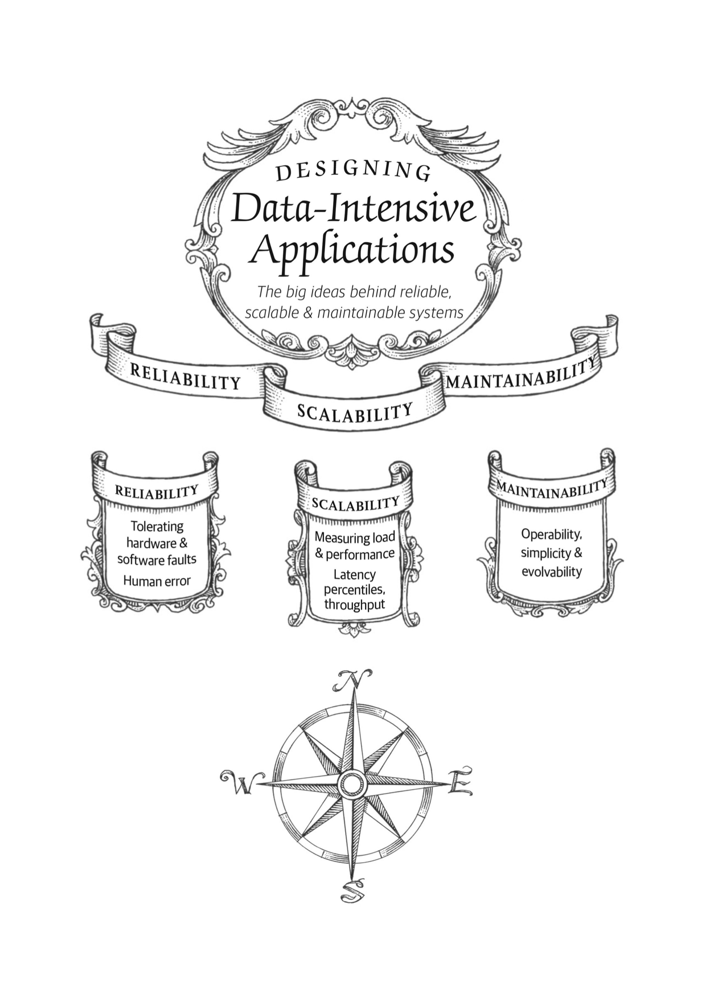
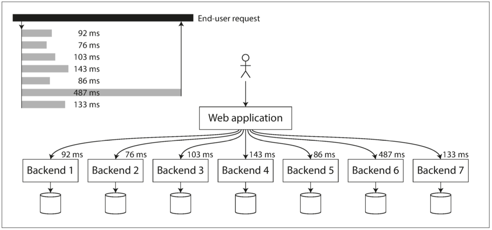

# 第一章：可靠性、可扩展性、可维护性



> 互联网做得太棒了，以至于大多数人将它看作像太平洋这样的自然资源，而不是什么人工产物。上一次出现这种大规模且无差错的技术， 你还记得是什么时候吗？
>
> ——阿兰·凯在接受Dobb博士杂志采访时说（2012年）

\[TOC\]

现今很多应用程序都是 **数据密集型（data-intensive）** 的，而非 **计算密集型（compute-intensive）** 的。因此CPU很少成为这类应用的瓶颈，更大的问题通常来自数据量、数据复杂性、以及数据的变更速度。

数据密集型应用通常由标准组件构建而成，标准组件提供了很多通用的功能；例如，许多应用程序都需要：

* 存储数据，以便自己或其他应用程序之后能再次找到 （_**数据库（database）**_）
* 记住开销昂贵操作的结果，加快读取速度（_**缓存（cache）**_）
* 允许用户按关键字搜索数据，或以各种方式对数据进行过滤（_**搜索索引（search indexes）**_）
* 向其他进程发送消息，进行异步处理（_**流处理（stream processing）**_）
* 定期处理累积的大批量数据（_**批处理（batch processing）**_）

如果这些功能听上去平淡无奇，那是因为这些 **数据系统（data system）** 是非常成功的抽象：我们一直不假思索地使用它们并习以为常。绝大多数工程师不会幻想从零开始编写存储引擎，因为在开发应用时，数据库已经是足够完美的工具了。

​ 但现实没有这么简单。不同的应用有着不同的需求，因而数据库系统也是百花齐放，有着各式各样的特性。实现缓存有很多种手段，创建搜索索引也有好几种方法，诸如此类。因此在开发应用前，我们依然有必要先弄清楚最适合手头工作的工具和方法。而且当单个工具解决不了你的问题时，组合使用这些工具可能还是有些难度的。

​ 本书将是一趟关于数据系统原理、实践与应用的旅程，并讲述了设计数据密集型应用的方法。我们将探索不同工具之间的共性与特性，以及各自的实现原理。

​ 本章将从我们所要实现的基础目标开始：可靠、可扩展、可维护的数据系统。我们将澄清这些词语的含义，概述考量这些目标的方法。并回顾一些后续章节所需的基础知识。在接下来的章节中我们将抽丝剥茧，研究设计数据密集型应用时可能遇到的设计决策。

## 关于数据系统的思考

​ 我们通常认为，数据库、消息队列、缓存等工具分属于几个差异显著的类别。虽然数据库和消息队列表面上有一些相似性——它们都会存储一段时间的数据——但它们有迥然不同的访问模式，这意味着迥异的性能特征和实现手段。

​ 那我们为什么要把这些东西放在 **数据系统（data system）** 的总称之下混为一谈呢？

​ 近些年来，出现了许多新的数据存储工具与数据处理工具。它们针对不同应用场景进行优化，因此不再适合生硬地归入传统类别【1】。类别之间的界限变得越来越模糊，例如：数据存储可以被当成消息队列用（Redis），消息队列则带有类似数据库的持久保证（Apache Kafka）。

​ 其次，越来越多的应用程序有着各种严格而广泛的要求，单个工具不足以满足所有的数据处理和存储需求。取而代之的是，总体工作被拆分成一系列能被单个工具高效完成的任务，并通过应用代码将它们缝合起来。

​ 例如，如果将缓存（应用管理的缓存层，Memcached或同类产品）和全文搜索（全文搜索服务器，例如Elasticsearch或Solr）功能从主数据库剥离出来，那么使缓存/索引与主数据库保持同步通常是应用代码的责任。[图1-1](https://github.com/atlas927/ddia/tree/315c42dec3e9b1106dce0f2bcd97c222da7f08ac/img/fig1-1.png) 给出了这种架构可能的样子（细节将在后面的章节中详细介绍）。


**图1-1 一个可能的组合使用多个组件的数据系统架构**

​ 当你将多个工具组合在一起提供服务时，服务的接口或**应用程序编程接口（API, Application Programming Interface）**通常向客户端隐藏这些实现细节。现在，你基本上已经使用较小的通用组件创建了一个全新的、专用的数据系统。这个新的复合数据系统可能会提供特定的保证，例如：缓存在写入时会作废或更新，以便外部客户端获取一致的结果。现在你不仅是应用程序开发人员，还是数据系统设计人员了。

​ 设计数据系统或服务时可能会遇到很多棘手的问题，例如：当系统出问题时，如何确保数据的正确性和完整性？当部分系统退化降级时，如何为客户提供始终如一的良好性能？当负载增加时，如何扩容应对？什么样的API才是好的API？

​ 影响数据系统设计的因素很多，包括参与人员的技能和经验、历史遗留问题、系统路径依赖、交付时限、公司的风险容忍度、监管约束等，这些因素都需要具体问题具体分析。

​ 本书着重讨论三个在大多数软件系统中都很重要的问题：

_**可靠性（Reliability）**_

​ 系统在**困境（adversity）**（硬件故障、软件故障、人为错误）中仍可正常工作（正确完成功能，并能达到期望的性能水准）。

_**可扩展性（Scalability）**_

​ 有合理的办法应对系统的增长（数据量、流量、复杂性）（参阅“[可扩展性](ch1.md#可扩展性)”）

_**可维护性（Maintainability）**_

​ 许多不同的人（工程师、运维）在不同的生命周期，都能高效地在系统上工作（使系统保持现有行为，并适应新的应用场景）。（参阅”[可维护性](ch1.md#可维护性)“）

​ 人们经常追求这些词汇，却没有清楚理解它们到底意味着什么。为了工程的严谨性，本章的剩余部分将探讨可靠性、可扩展性、可维护性的含义。为实现这些目标而使用的各种技术，架构和算法将在后续的章节中研究。

## 可靠性

人们对于一个东西是否可靠，都有一个直观的想法。人们对可靠软件的典型期望包括：

* 应用程序表现出用户所期望的功能。
* 允许用户犯错，允许用户以出乎意料的方式使用软件。
* 在预期的负载和数据量下，性能满足要求。
* 系统能防止未经授权的访问和滥用。

如果所有这些在一起意味着“正确工作”，那么可以把可靠性粗略理解为“即使出现问题，也能继续正确工作”。

​ 造成错误的原因叫做**故障（fault）**，能预料并应对故障的系统特性可称为**容错（fault-tolerant）**或**韧性（resilient）**。“**容错**”一词可能会产生误导，因为它暗示着系统可以容忍所有可能的错误，但在实际中这是不可能的。比方说，如果整个地球（及其上的所有服务器）都被黑洞吞噬了，想要容忍这种错误，需要把网络托管到太空中——这种预算能不能批准就祝你好运了。所以在讨论容错时，只有谈论特定类型的错误才有意义。

​ 注意**故障（fault）**不同于**失效（failure）**【2】。**故障**通常定义为系统的一部分状态偏离其标准，而**失效**则是系统作为一个整体停止向用户提供服务。故障的概率不可能降到零，因此最好设计容错机制以防因**故障**而导致**失效**。本书中我们将介绍几种用不可靠的部件构建可靠系统的技术。

​ 反直觉的是，在这类容错系统中，通过故意触发来**提高**故障率是有意义的，例如：在没有警告的情况下随机地杀死单个进程。许多高危漏洞实际上是由糟糕的错误处理导致的【3】，因此我们可以通过故意引发故障来确保容错机制不断运行并接受考验，从而提高故障自然发生时系统能正确处理的信心。Netflix公司的_Chaos Monkey_【4】就是这种方法的一个例子。

​ 尽管比起**阻止错误（prevent error）**，我们通常更倾向于**容忍错误**。但也有**预防胜于治疗**的情况（比如不存在治疗方法时）。安全问题就属于这种情况。例如，如果攻击者破坏了系统，并获取了敏感数据，这种事是撤销不了的。但本书主要讨论的是可以恢复的故障种类，正如下面几节所述。

### 硬件故障

​ 当想到系统失效的原因时，**硬件故障（hardware faults）**总会第一个进入脑海。硬盘崩溃、内存出错、机房断电、有人拔错网线……任何与大型数据中心打过交道的人都会告诉你：一旦你拥有很多机器，这些事情**总**会发生！

​ 据报道称，硬盘的 **平均无故障时间（MTTF mean time to failure）** 约为10到50年【5】【6】。因此从数学期望上讲，在拥有10000个磁盘的存储集群上，平均每天会有1个磁盘出故障。

​ 为了减少系统的故障率，第一反应通常都是增加单个硬件的冗余度，例如：磁盘可以组建RAID，服务器可能有双路电源和热插拔CPU，数据中心可能有电池和柴油发电机作为后备电源，某个组件挂掉时冗余组件可以立刻接管。这种方法虽然不能完全防止由硬件问题导致的系统失效，但它简单易懂，通常也足以让机器不间断运行很多年。

​ 直到最近，硬件冗余对于大多数应用来说已经足够了，它使单台机器完全失效变得相当罕见。只要你能快速地把备份恢复到新机器上，故障停机时间对大多数应用而言都算不上灾难性的。只有少量高可用性至关重要的应用才会要求有多套硬件冗余。

​ 但是随着数据量和应用计算需求的增加，越来越多的应用开始大量使用机器，这会相应地增加硬件故障率。此外在一些云平台（**如亚马逊网络服务（AWS, Amazon Web Services）**）中，虚拟机实例不可用却没有任何警告也是很常见的【7】，因为云平台的设计就是优先考虑**灵活性（flexibility）**和**弹性（elasticity）**，而不是单机可靠性。

​ 如果在硬件冗余的基础上进一步引入软件容错机制，那么系统在容忍整个（单台）机器故障的道路上就更进一步了。这样的系统也有运维上的便利，例如：如果需要重启机器（例如应用操作系统安全补丁），单服务器系统就需要计划停机。而允许机器失效的系统则可以一次修复一个节点，无需整个系统停机。

### 软件错误

​ 我们通常认为硬件故障是随机的、相互独立的：一台机器的磁盘失效并不意味着另一台机器的磁盘也会失效。大量硬件组件不可能同时发生故障，除非它们存在比较弱的相关性（同样的原因导致关联性错误，例如服务器机架的温度）。

​ 另一类错误是内部的**系统性错误（systematic error）**【7】。这类错误难以预料，而且因为是跨节点相关的，所以比起不相关的硬件故障往往可能造成更多的**系统失效**【5】。例子包括：

* 接受特定的错误输入，便导致所有应用服务器实例崩溃的BUG。例如2012年6月30日的闰秒，由于Linux内核中的一个错误，许多应用同时挂掉了。
* 失控进程会占用一些共享资源，包括CPU时间、内存、磁盘空间或网络带宽。
* 系统依赖的服务变慢，没有响应，或者开始返回错误的响应。
* 级联故障，一个组件中的小故障触发另一个组件中的故障，进而触发更多的故障【10】。

导致这类软件故障的BUG通常会潜伏很长时间，直到被异常情况触发为止。这种情况意味着软件对其环境做出了某种假设——虽然这种假设通常来说是正确的，但由于某种原因最后不再成立了【11】。

​ 虽然软件中的系统性故障没有速效药，但我们还是有很多小办法，例如：仔细考虑系统中的假设和交互；彻底的测试；进程隔离；允许进程崩溃并重启；测量、监控并分析生产环境中的系统行为。如果系统能够提供一些保证（例如在一个消息队列中，进入与发出的消息数量相等），那么系统就可以在运行时不断自检，并在出现**差异（discrepancy）**时报警【12】。

### 人为错误

​ 设计并构建了软件系统的工程师是人类，维持系统运行的运维也是人类。即使他们怀有最大的善意，人类也是不可靠的。举个例子，一项关于大型互联网服务的研究发现，运维配置错误是导致服务中断的首要原因，而硬件故障（服务器或网络）仅导致了10-25％的服务中断【13】。

​ 尽管人类不可靠，但怎么做才能让系统变得可靠？最好的系统会组合使用以下几种办法：

* 以最小化犯错机会的方式设计系统。例如，精心设计的抽象、API和管理后台使做对事情更容易，搞砸事情更困难。但如果接口限制太多，人们就会忽略它们的好处而想办法绕开。很难正确把握这种微妙的平衡。
* 将人们最容易犯错的地方与可能导致失效的地方**解耦（decouple）**。特别是提供一个功能齐全的非生产环境**沙箱（sandbox）**，使人们可以在不影响真实用户的情况下，使用真实数据安全地探索和实验。
* 在各个层次进行彻底的测试【3】，从单元测试、全系统集成测试到手动测试。自动化测试易于理解，已经被广泛使用，特别适合用来覆盖正常情况中少见的**边缘场景（corner case）**。
* 允许从人为错误中简单快速地恢复，以最大限度地减少失效情况带来的影响。 例如，快速回滚配置变更，分批发布新代码（以便任何意外错误只影响一小部分用户），并提供数据重算工具（以备旧的计算出错）。
* 配置详细和明确的监控，比如性能指标和错误率。 在其他工程学科中这指的是**遥测（telemetry）**。 （一旦火箭离开了地面，遥测技术对于跟踪发生的事情和理解失败是至关重要的。）监控可以向我们发出预警信号，并允许我们检查是否有任何地方违反了假设和约束。当出现问题时，指标数据对于问题诊断是非常宝贵的。
* 良好的管理实践与充分的培训——一个复杂而重要的方面，但超出了本书的范围。

### 可靠性有多重要？

​ 可靠性不仅仅是针对核电站和空中交通管制软件而言，我们也期望更多平凡的应用能可靠地运行。商务应用中的错误会导致生产力损失（也许数据报告不完整还会有法律风险），而电商网站的中断则可能会导致收入和声誉的巨大损失。

​ 即使在“非关键”应用中，我们也对用户负有责任。试想一位家长把所有的照片和孩子的视频储存在你的照片应用里【15】。如果数据库突然损坏，他们会感觉如何？他们可能会知道如何从备份恢复吗？

​ 在某些情况下，我们可能会选择牺牲可靠性来降低开发成本（例如为未经证实的市场开发产品原型）或运营成本（例如利润率极低的服务），但我们偷工减料时，应该清楚意识到自己在做什么。

## 可扩展性

​ 系统今天能可靠运行，并不意味未来也能可靠运行。服务 **降级（degradation）** 的一个常见原因是负载增加，例如：系统负载已经从一万个并发用户增长到十万个并发用户，或者从一百万增长到一千万。也许现在处理的数据量级要比过去大得多。

​ **可扩展性（Scalability）** 是用来描述系统应对负载增长能力的术语。但是请注意，这不是贴在系统上的一维标签：说“X可扩展”或“Y不可扩展”是没有任何意义的。相反，讨论可扩展性意味着考虑诸如“如果系统以特定方式增长，有什么选项可以应对增长？”和“如何增加计算资源来处理额外的负载？”等问题。

### 描述负载

​ 在讨论增长问题（如果负载加倍会发生什么？）前，首先要能简要描述系统的当前负载。负载可以用一些称为 **负载参数（load parameters）** 的数字来描述。参数的最佳选择取决于系统架构，它可能是每秒向Web服务器发出的请求、数据库中的读写比率、聊天室中同时活跃的用户数量、缓存命中率或其他东西。除此之外，也许平均情况对你很重要，也许你的瓶颈是少数极端场景。

​ 为了使这个概念更加具体，我们以推特在2012年11月发布的数据【16】为例。推特的两个主要业务是：

_**发布推文**_

​ 用户可以向其粉丝发布新消息（平均 4.6k请求/秒，峰值超过 12k请求/秒）。

_**主页时间线**_

​ 用户可以查阅他们关注的人发布的推文（300k请求/秒）。

​ 处理每秒12,000次写入（发推文的速率峰值）还是很简单的。然而推特的扩展性挑战并不是主要来自推特量，而是来自**扇出（fan-out）**——每个用户关注了很多人，也被很多人关注。

大体上讲，这一对操作有两种实现方式。

1. 发布推文时，只需将新推文插入全局推文集合即可。当一个用户请求自己的主页时间线时，首先查找他关注的所有人，查询这些被关注用户发布的推文并按时间顺序合并。在如[图1-2](https://github.com/atlas927/ddia/tree/315c42dec3e9b1106dce0f2bcd97c222da7f08ac/img/fig1-2.png)所示的关系型数据库中，可以编写这样的查询：

   ```sql
    SELECT tweets.*, users.*
      FROM tweets
      JOIN users   ON tweets.sender_id = users.id
      JOIN follows ON follows.followee_id = users.id
      WHERE follows.follower_id = current_user
   ```

   

   **图1-2 推特主页时间线的关系型模式简单实现**

2. 为每个用户的主页时间线维护一个缓存，就像每个用户的推文收件箱（[图1-3](https://github.com/atlas927/ddia/tree/315c42dec3e9b1106dce0f2bcd97c222da7f08ac/img/fig1-3.png)）。 当一个用户发布推文时，查找所有关注该用户的人，并将新的推文插入到每个主页时间线缓存中。 因此读取主页时间线的请求开销很小，因为结果已经提前计算好了。

   

   **图1-3 用于分发推特至关注者的数据流水线，2012年11月的负载参数【16】**

推特的第一个版本使用了方法1，但系统很难跟上主页时间线查询的负载。所以公司转向了方法2，方法2的效果更好，因为发推频率比查询主页时间线的频率几乎低了两个数量级，所以在这种情况下，最好在写入时做更多的工作，而在读取时做更少的工作。

​ 然而方法2的缺点是，发推现在需要大量的额外工作。平均来说，一条推文会发往约75个关注者，所以每秒4.6k的发推写入，变成了对主页时间线缓存每秒345k的写入。但这个平均值隐藏了用户粉丝数差异巨大这一现实，一些用户有超过3000万的粉丝，这意味着一条推文就可能会导致主页时间线缓存的3000万次写入！及时完成这种操作是一个巨大的挑战 —— 推特尝试在5秒内向粉丝发送推文。

​ 在推特的例子中，每个用户粉丝数的分布（可能按这些用户的发推频率来加权）是探讨可扩展性的一个关键负载参数，因为它决定了扇出负载。你的应用程序可能具有非常不同的特征，但可以采用相似的原则来考虑它的负载。

​ 推特轶事的最终转折：现在已经稳健地实现了方法2，推特逐步转向了两种方法的混合。大多数用户发的推文会被扇出写入其粉丝主页时间线缓存中。但是少数拥有海量粉丝的用户（即名流）会被排除在外。当用户读取主页时间线时，分别地获取出该用户所关注的每位名流的推文，再与用户的主页时间线缓存合并，如方法1所示。这种混合方法能始终如一地提供良好性能。在[第12章](../part-iii/ch12.md)中我们将重新讨论这个例子，这在覆盖更多技术层面之后。

### 描述性能

一旦系统的负载被描述好，就可以研究当负载增加会发生什么。我们可以从两种角度来看：

* 增加负载参数并保持系统资源（CPU、内存、网络带宽等）不变时，系统性能将受到什么影响？
* 增加负载参数并希望保持性能不变时，需要增加多少系统资源？

这两个问题都需要性能数据，所以让我们简单地看一下如何描述系统性能。

​ 对于Hadoop这样的批处理系统，通常关心的是**吞吐量（throughput）**，即每秒可以处理的记录数量，或者在特定规模数据集上运行作业的总时间。对于在线系统，通常更重要的是服务的**响应时间（response time）**，即客户端发送请求到接收响应之间的时间。

> #### 延迟和响应时间
>
> **延迟（latency）** 和 **响应时间（response time）** 经常用作同义词，但实际上它们并不一样。响应时间是客户所看到的，除了实际处理请求的时间（ **服务时间（service time）** ）之外，还包括网络延迟和排队延迟。延迟是某个请求等待处理的**持续时长**，在此期间它处于 **休眠（latent）** 状态，并等待服务【17】。

​ 即使不断重复发送同样的请求，每次得到的响应时间也都会略有不同。现实世界的系统会处理各式各样的请求，响应时间可能会有很大差异。因此我们需要将响应时间视为一个可以测量的数值**分布（distribution）**，而不是单个数值。

​ 在[图1-4](https://github.com/atlas927/ddia/tree/315c42dec3e9b1106dce0f2bcd97c222da7f08ac/img/fig1-4.png)中，每个灰条表代表一次对服务的请求，其高度表示请求花费了多长时间。大多数请求是相当快的，但偶尔会出现需要更长的时间的异常值。这也许是因为缓慢的请求实质上开销更大，例如它们可能会处理更多的数据。但即使（你认为）所有请求都花费相同时间的情况下，随机的附加延迟也会导致结果变化，例如：上下文切换到后台进程，网络数据包丢失与TCP重传，垃圾收集暂停，强制从磁盘读取的页面错误，服务器机架中的震动【18】，还有很多其他原因。


**图1-4 展示了一个服务100次请求响应时间的均值与百分位数**

​ 通常报表都会展示服务的平均响应时间。 （严格来讲“平均”一词并不指代任何特定公式，但实际上它通常被理解为**算术平均值（arithmetic mean）**：给定 n 个值，加起来除以 n ）。然而如果你想知道“**典型（typical）**”响应时间，那么平均值并不是一个非常好的指标，因为它不能告诉你有多少用户实际上经历了这个延迟。

​ 通常使用**百分位点（percentiles）**会更好。如果将响应时间列表按最快到最慢排序，那么**中位数（median）**就在正中间：举个例子，如果你的响应时间中位数是200毫秒，这意味着一半请求的返回时间少于200毫秒，另一半比这个要长。

​ 如果想知道典型场景下用户需要等待多长时间，那么中位数是一个好的度量标准：一半用户请求的响应时间少于响应时间的中位数，另一半服务时间比中位数长。中位数也被称为第50百分位点，有时缩写为p50。注意中位数是关于单个请求的；如果用户同时发出几个请求（在一个会话过程中，或者由于一个页面中包含了多个资源），则至少一个请求比中位数慢的概率远大于50％。

​ 为了弄清异常值有多糟糕，可以看看更高的百分位点，例如第95、99和99.9百分位点（缩写为p95，p99和p999）。它们意味着95％，99％或99.9％的请求响应时间要比该阈值快，例如：如果第95百分位点响应时间是1.5秒，则意味着100个请求中的95个响应时间快于1.5秒，而100个请求中的5个响应时间超过1.5秒。如[图1-4](https://github.com/atlas927/ddia/tree/315c42dec3e9b1106dce0f2bcd97c222da7f08ac/img/fig1-4.png)所示。

​ 响应时间的高百分位点（也称为**尾部延迟（tail latencies）**）非常重要，因为它们直接影响用户的服务体验。例如亚马逊在描述内部服务的响应时间要求时以99.9百分位点为准，即使它只影响一千个请求中的一个。这是因为请求响应最慢的客户往往也是数据最多的客户，也可以说是最有价值的客户 —— 因为他们掏钱了【19】。保证网站响应迅速对于保持客户的满意度非常重要，亚马逊观察到：响应时间增加100毫秒，销售量就减少1％【20】；而另一些报告说：慢 1 秒钟会让客户满意度指标减少16%【21，22】。

​ 另一方面，优化第99.99百分位点（一万个请求中最慢的一个）被认为太昂贵了，不能为亚马逊的目标带来足够好处。减小高百分位点处的响应时间相当困难，因为它很容易受到随机事件的影响，这超出了控制范围，而且效益也很小。

​ 百分位点通常用于**服务级别目标（SLO, service level objectives）**和**服务级别协议（SLA, service level agreements）**，即定义服务预期性能和可用性的合同。 SLA可能会声明，如果服务响应时间的中位数小于200毫秒，且99.9百分位点低于1秒，则认为服务工作正常（如果响应时间更长，就认为服务不达标）。这些指标为客户设定了期望值，并允许客户在SLA未达标的情况下要求退款。

​ **排队延迟（queueing delay）** 通常占了高百分位点处响应时间的很大一部分。由于服务器只能并行处理少量的事务（如受其CPU核数的限制），所以只要有少量缓慢的请求就能阻碍后续请求的处理，这种效应有时被称为 **头部阻塞（head-of-line blocking）** 。即使后续请求在服务器上处理的非常迅速，由于需要等待先前请求完成，客户端最终看到的是缓慢的总体响应时间。因为存在这种效应，测量客户端的响应时间非常重要。

​ 为测试系统的可扩展性而人为产生负载时，产生负载的客户端要独立于响应时间不断发送请求。如果客户端在发送下一个请求之前等待先前的请求完成，这种行为会产生人为排队的效果，使得测试时的队列比现实情况更短，使测量结果产生偏差【23】。

> #### 实践中的百分位点
>
> ​ 在多重调用的后端服务里，高百分位数变得特别重要。即使并行调用，最终用户请求仍然需要等待最慢的并行调用完成。如[图1-5](https://github.com/atlas927/ddia/tree/315c42dec3e9b1106dce0f2bcd97c222da7f08ac/img/fig1-5.png)所示，只需要一个缓慢的调用就可以使整个最终用户请求变慢。即使只有一小部分后端调用速度较慢，如果最终用户请求需要多个后端调用，则获得较慢调用的机会也会增加，因此较高比例的最终用户请求速度会变慢（效果称为尾部延迟放大【24】）。
>
> ​ 如果您想将响应时间百分点添加到您的服务的监视仪表板，则需要持续有效地计算它们。例如，您可能希望在最近10分钟内保持请求响应时间的滚动窗口。每一分钟，您都会计算出该窗口中的中值和各种百分数，并将这些度量值绘制在图上。
>
> ​ 简单的实现是在时间窗口内保存所有请求的响应时间列表，并且每分钟对列表进行排序。如果对你来说效率太低，那么有一些算法能够以最小的CPU和内存成本（如前向衰减【25】，t-digest【26】或HdrHistogram 【27】）来计算百分位数的近似值。请注意，平均百分比（例如，减少时间分辨率或合并来自多台机器的数据）在数学上没有意义 - 聚合响应时间数据的正确方法是添加直方图【28】。



**图1-5 当一个请求需要多个后端请求时，单个后端慢请求就会拖慢整个终端用户的请求**

### 应对负载的方法

​ 现在我们已经讨论了用于描述负载的参数和用于衡量性能的指标。可以开始认真讨论可扩展性了：当负载参数增加时，如何保持良好的性能？

​ 适应某个级别负载的架构不太可能应付10倍于此的负载。如果你正在开发一个快速增长的服务，那么每次负载发生数量级的增长时，你可能都需要重新考虑架构——或者更频繁。

​ 人们经常讨论**纵向扩展（scaling up）**（**垂直扩展（vertical scaling）**，转向更强大的机器）和**横向扩展（scaling out）** （**水平扩展（horizontal scaling）**，将负载分布到多台小机器上）之间的对立。跨多台机器分配负载也称为“**无共享（shared-nothing）**”架构。可以在单台机器上运行的系统通常更简单，但高端机器可能非常贵，所以非常密集的负载通常无法避免地需要横向扩展。现实世界中的优秀架构需要将这两种方法务实地结合，因为使用几台足够强大的机器可能比使用大量的小型虚拟机更简单也更便宜。

​ 有些系统是 **弹性（elastic）** 的，这意味着可以在检测到负载增加时自动增加计算资源，而其他系统则是手动扩展（人工分析容量并决定向系统添加更多的机器）。如果负载**极难预测（highly unpredictable）**，则弹性系统可能很有用，但手动扩展系统更简单，并且意外操作可能会更少（参阅“[重新平衡分区](../part-ii/ch6.md#分区再平衡)”）。

​ 跨多台机器部署**无状态服务（stateless services）**非常简单，但将带状态的数据系统从单节点变为分布式配置则可能引入许多额外复杂度。出于这个原因，常识告诉我们应该将数据库放在单个节点上（纵向扩展），直到扩展成本或可用性需求迫使其改为分布式。

​ 随着分布式系统的工具和抽象越来越好，至少对于某些类型的应用而言，这种常识可能会改变。可以预见分布式数据系统将成为未来的默认设置，即使对不处理大量数据或流量的场景也如此。本书的其余部分将介绍多种分布式数据系统，不仅讨论它们在可扩展性方面的表现，还包括易用性和可维护性。

​ 大规模的系统架构通常是应用特定的—— 没有一招鲜吃遍天的通用可扩展架构（不正式的叫法：**万金油（magic scaling sauce）** ）。应用的问题可能是读取量、写入量、要存储的数据量、数据的复杂度、响应时间要求、访问模式或者所有问题的大杂烩。

​ 举个例子，用于处理每秒十万个请求（每个大小为1 kB）的系统与用于处理每分钟3个请求（每个大小为2GB）的系统看上去会非常不一样，尽管两个系统有同样的数据吞吐量。

​ 一个良好适配应用的可扩展架构，是围绕着**假设（assumption）**建立的：哪些操作是常见的？哪些操作是罕见的？这就是所谓负载参数。如果假设最终是错误的，那么为扩展所做的工程投入就白费了，最糟糕的是适得其反。在早期创业公司或非正式产品中，通常支持产品快速迭代的能力，要比可扩展至未来的假想负载要重要的多。

​ 尽管这些架构是应用程序特定的，但可扩展的架构通常也是从通用的积木块搭建而成的，并以常见的模式排列。在本书中，我们将讨论这些构件和模式。

## 可维护性

​ 众所周知，软件的大部分开销并不在最初的开发阶段，而是在持续的维护阶段，包括修复漏洞、保持系统正常运行、调查失效、适配新的平台、为新的场景进行修改、偿还技术债、添加新的功能等等。

​ 不幸的是，许多从事软件系统行业的人不喜欢维护所谓的**遗留（legacy）**系统，——也许因为涉及修复其他人的错误、和过时的平台打交道，或者系统被迫使用于一些份外工作。每一个遗留系统都以自己的方式让人不爽，所以很难给出一个通用的建议来和它们打交道。

​ 但是我们可以，也应该以这样一种方式来设计软件：在设计之初就尽量考虑尽可能减少维护期间的痛苦，从而避免自己的软件系统变成遗留系统。为此，我们将特别关注软件系统的三个设计原则：

_**可操作性（Operability）**_

​ 便于运维团队保持系统平稳运行。

_**简单性（Simplicity）**_

​ 从系统中消除尽可能多的**复杂度（complexity）**，使新工程师也能轻松理解系统。（注意这和用户接口的简单性不一样。）

_**可演化性（evolability）**_

​ 使工程师在未来能轻松地对系统进行更改，当需求变化时为新应用场景做适配。也称为**可扩展性（extensibility）**，**可修改性（modifiability）**或**可塑性（plasticity）**。

​ 和之前提到的可靠性、可扩展性一样，实现这些目标也没有简单的解决方案。不过我们会试着想象具有可操作性，简单性和可演化性的系统会是什么样子。

### 可操作性：人生苦短，关爱运维

​ 有人认为，“良好的运维经常可以绕开垃圾（或不完整）软件的局限性，而再好的软件摊上垃圾运维也没法可靠运行”。尽管运维的某些方面可以，而且应该是自动化的，但在最初建立正确运作的自动化机制仍然取决于人。

运维团队对于保持软件系统顺利运行至关重要。一个优秀运维团队的典型职责如下（或者更多）【29】：

* 监控系统的运行状况，并在服务状态不佳时快速恢复服务
* 跟踪问题的原因，例如系统故障或性能下降
* 及时更新软件和平台，比如安全补丁
* 了解系统间的相互作用，以便在异常变更造成损失前进行规避。
* 预测未来的问题，并在问题出现之前加以解决（例如，容量规划）
* 建立部署，配置、管理方面的良好实践，编写相应工具
* 执行复杂的维护任务，例如将应用程序从一个平台迁移到另一个平台
* 当配置变更时，维持系统的安全性
* 定义工作流程，使运维操作可预测，并保持生产环境稳定。
* 铁打的营盘流水的兵，维持组织对系统的了解。

良好的可操作性意味着更轻松的日常工作，进而运维团队能专注于高价值的事情。数据系统可以通过各种方式使日常任务更轻松：

* 通过良好的监控，提供对系统内部状态和运行时行为的**可见性（visibility）**
* 为自动化提供良好支持，将系统与标准化工具相集成
* 避免依赖单台机器（在整个系统继续不间断运行的情况下允许机器停机维护）
* 提供良好的文档和易于理解的操作模型（“如果做X，会发生Y”）
* 提供良好的默认行为，但需要时也允许管理员自由覆盖默认值
* 有条件时进行自我修复，但需要时也允许管理员手动控制系统状态
* 行为可预测，最大限度减少意外

### 简单性：管理复杂度

​ 小型软件项目可以使用简单讨喜的、富表现力的代码，但随着项目越来越大，代码往往变得非常复杂，难以理解。这种复杂度拖慢了所有系统相关人员，进一步增加了维护成本。一个陷入复杂泥潭的软件项目有时被描述为 **烂泥潭（a big ball of mud）** 【30】。

​ **复杂度（complexity）** 有各种可能的症状，例如：状态空间激增、模块间紧密耦合、纠结的依赖关系、不一致的命名和术语、解决性能问题的Hack、需要绕开的特例等等，现在已经有很多关于这个话题的讨论【31,32,33】。

​ 因为复杂度导致维护困难时，预算和时间安排通常会超支。在复杂的软件中进行变更，引入错误的风险也更大：当开发人员难以理解系统时，隐藏的假设、无意的后果和意外的交互就更容易被忽略。相反，降低复杂度能极大地提高软件的可维护性，因此简单性应该是构建系统的一个关键目标。

​ 简化系统并不一定意味着减少功能；它也可以意味着消除**额外的（accidental）**的复杂度。 Moseley和Marks【32】把 **额外复杂度** 定义为：由具体实现中涌现，而非（从用户视角看，系统所解决的）问题本身固有的复杂度。

​ 用于消除**额外复杂度**的最好工具之一是**抽象（abstraction）**。一个好的抽象可以将大量实现细节隐藏在一个干净，简单易懂的外观下面。一个好的抽象也可以广泛用于各类不同应用。比起重复造很多轮子，重用抽象不仅更有效率，而且有助于开发高质量的软件。抽象组件的质量改进将使所有使用它的应用受益。

​ 例如，高级编程语言是一种抽象，隐藏了机器码、CPU寄存器和系统调用。 SQL也是一种抽象，隐藏了复杂的磁盘/内存数据结构、来自其他客户端的并发请求、崩溃后的不一致性。当然在用高级语言编程时，我们仍然用到了机器码；只不过没有**直接（directly）**使用罢了，正是因为编程语言的抽象，我们才不必去考虑这些实现细节。

​ 抽象可以帮助我们将系统的复杂度控制在可管理的水平，不过，找到好的抽象是非常困难的。在分布式系统领域虽然有许多好的算法，但我们并不清楚它们应该打包成什么样抽象。

​ 本书将紧盯那些允许我们将大型系统的部分提取为定义明确的、可重用的组件的优秀抽象。

### 可演化性：拥抱变化

​ 系统的需求永远不变，基本是不可能的。更可能的情况是，它们处于常态的变化中，例如：你了解了新的事实、出现意想不到的应用场景、业务优先级发生变化、用户要求新功能、新平台取代旧平台、法律或监管要求发生变化、系统增长迫使架构变化等。

​ 在组织流程方面， **敏捷（agile）** 工作模式为适应变化提供了一个框架。敏捷社区还开发了对在频繁变化的环境中开发软件很有帮助的技术工具和模式，如 **测试驱动开发（TDD, test-driven development）** 和 **重构（refactoring）** 。

​ 这些敏捷技术的大部分讨论都集中在相当小的规模（同一个应用中的几个代码文件）。本书将探索在更大数据系统层面上提高敏捷性的方法，可能由几个不同的应用或服务组成。例如，为了将装配主页时间线的方法从方法1变为方法2，你会如何“重构”推特的架构 ？

​ 修改数据系统并使其适应不断变化需求的容易程度，是与**简单性**和**抽象性**密切相关的：简单易懂的系统通常比复杂系统更容易修改。但由于这是一个非常重要的概念，我们将用一个不同的词来指代数据系统层面的敏捷性： **可演化性（evolvability）** 【34】。

## 本章小结

​ 本章探讨了一些关于数据密集型应用的基本思考方式。这些原则将指导我们阅读本书的其余部分，那里将会深入技术细节。

​ 一个应用必须满足各种需求才称得上有用。有一些**功能需求（functional requirements）**（它应该做什么，比如允许以各种方式存储，检索，搜索和处理数据）以及一些**非功能性需求（nonfunctional ）**（通用属性，例如安全性，可靠性，合规性，可扩展性，兼容性和可维护性）。在本章详细讨论了可靠性，可扩展性和可维护性。

​ **可靠性（Reliability）** 意味着即使发生故障，系统也能正常工作。故障可能发生在硬件（通常是随机的和不相关的），软件（通常是系统性的Bug，很难处理），和人类（不可避免地时不时出错）。 **容错技术** 可以对终端用户隐藏某些类型的故障。

​ **可扩展性（Scalability）** 意味着即使在负载增加的情况下也有保持性能的策略。为了讨论可扩展性，我们首先需要定量描述负载和性能的方法。我们简要了解了推特主页时间线的例子，介绍描述负载的方法，并将响应时间百分位点作为衡量性能的一种方式。在可扩展的系统中可以添加 **处理容量（processing capacity）** 以在高负载下保持可靠。

​ **可维护性（Maintainability）** 有许多方面，但实质上是关于工程师和运维团队的生活质量的。良好的抽象可以帮助降低复杂度，并使系统易于修改和适应新的应用场景。良好的可操作性意味着对系统的健康状态具有良好的可见性，并拥有有效的管理手段。

​ 不幸的是，使应用可靠、可扩展或可维护并不容易。但是某些模式和技术会不断重新出现在不同的应用中。在接下来的几章中，我们将看到一些数据系统的例子，并分析它们如何实现这些目标。

​ 在本书后面的[第三部分](../part-iii/)中，我们将看到一种模式：几个组件协同工作以构成一个完整的系统（如[图1-1](https://github.com/atlas927/ddia/tree/315c42dec3e9b1106dce0f2bcd97c222da7f08ac/img/fig1-1.png)中的例子）

## 参考文献

1. Michael Stonebraker and Uğur Çetintemel: “['One Size Fits All': An Idea Whose Time Has Come and Gone](http://citeseerx.ist.psu.edu/viewdoc/download?doi=10.1.1.68.9136&rep=rep1&type=pdf),” at _21st International Conference on Data Engineering_ \(ICDE\), April 2005.
2. Walter L. Heimerdinger and Charles B. Weinstock: “[A Conceptual Framework for System Fault Tolerance](http://www.sei.cmu.edu/reports/92tr033.pdf),” Technical Report CMU/SEI-92-TR-033, Software Engineering Institute, Carnegie Mellon University, October 1992.
3. Ding Yuan, Yu Luo, Xin Zhuang, et al.: “[Simple Testing Can Prevent Most Critical Failures: An Analysis of Production Failures in Distributed Data-Intensive Systems](https://www.usenix.org/system/files/conference/osdi14/osdi14-paper-yuan.pdf),” at _11th USENIX Symposium on Operating Systems Design and Implementation_ \(OSDI\), October 2014.
4. Yury Izrailevsky and Ariel Tseitlin: “[The Netflix Simian Army](http://techblog.netflix.com/2011/07/netflix-simian-army.html),” _techblog.netflix.com_, July 19, 2011.
5. Daniel Ford, François Labelle, Florentina I. Popovici, et al.: “[Availability in Globally Distributed Storage Systems](http://research.google.com/pubs/archive/36737.pdf),” at _9th USENIX Symposium on Operating Systems Design and Implementation_ \(OSDI\), October 2010.
6. Brian Beach: “[Hard Drive Reliability Update – Sep 2014](https://www.backblaze.com/blog/hard-drive-reliability-update-september-2014/),” _backblaze.com_, September 23, 2014.
7. Laurie Voss: “[AWS: The Good, the Bad and the Ugly](https://web.archive.org/web/20160429075023/http://blog.awe.sm/2012/12/18/aws-the-good-the-bad-and-the-ugly/),” _blog.awe.sm_, December 18, 2012.
8. Haryadi S. Gunawi, Mingzhe Hao, Tanakorn Leesatapornwongsa, et al.: “[What Bugs Live in the Cloud?](http://ucare.cs.uchicago.edu/pdf/socc14-cbs.pdf),” at _5th ACM Symposium on Cloud Computing_ \(SoCC\), November 2014. [doi:10.1145/2670979.2670986](http://dx.doi.org/10.1145/2670979.2670986)
9. Nelson Minar: “[Leap Second Crashes Half the Internet](http://www.somebits.com/weblog/tech/bad/leap-second-2012.html),” _somebits.com_, July 3, 2012.
10. Amazon Web Services: “[Summary of the Amazon EC2 and Amazon RDS Service Disruption in the US East Region](http://aws.amazon.com/message/65648/),” _aws.amazon.com_, April 29, 2011.
11. Richard I. Cook: “[How Complex Systems Fail](http://web.mit.edu/2.75/resources/random/How%20Complex%20Systems%20Fail.pdf),” Cognitive Technologies Laboratory, April 2000.
12. Jay Kreps: “[Getting Real About Distributed System Reliability](http://blog.empathybox.com/post/19574936361/getting-real-about-distributed-system-reliability),” _blog.empathybox.com_, March 19, 2012.
13. David Oppenheimer, Archana Ganapathi, and David A. Patterson: “[Why Do Internet Services Fail, and What Can Be Done About It?](http://static.usenix.org/legacy/events/usits03/tech/full_papers/oppenheimer/oppenheimer.pdf),” at _4th USENIX Symposium on Internet Technologies and Systems_ \(USITS\), March 2003.
14. Nathan Marz: “[Principles of Software Engineering, Part 1](http://nathanmarz.com/blog/principles-of-software-engineering-part-1.html),” _nathanmarz.com_, April 2, 2013.
15. Michael Jurewitz:“[The Human Impact of Bugs](http://jury.me/blog/2013/3/14/the-human-impact-of-bugs),” _jury.me_, March 15, 2013.
16. Raffi Krikorian: “[Timelines at Scale](http://www.infoq.com/presentations/Twitter-Timeline-Scalability),” at _QCon San Francisco_, November 2012.
17. Martin Fowler: _Patterns of Enterprise Application Architecture_. Addison Wesley, 2002. ISBN: 978-0-321-12742-6
18. Kelly Sommers: “[After all that run around, what caused 500ms disk latency even when we replaced physical server?](https://twitter.com/kellabyte/status/532930540777635840)” _twitter.com_, November 13, 2014.
19. Giuseppe DeCandia, Deniz Hastorun, Madan Jampani, et al.: “[Dynamo: Amazon's Highly Available Key-Value Store](http://www.allthingsdistributed.com/files/amazon-dynamo-sosp2007.pdf),” at _21st ACM Symposium on Operating Systems Principles_ \(SOSP\), October 2007.
20. Greg Linden: “[Make Data Useful](http://glinden.blogspot.co.uk/2006/12/slides-from-my-talk-at-stanford.html),” slides from presentation at Stanford University Data Mining class \(CS345\), December 2006.
21. Tammy Everts: “[The Real Cost of Slow Time vs Downtime](http://www.webperformancetoday.com/2014/11/12/real-cost-slow-time-vs-downtime-slides/),” _webperformancetoday.com_, November 12, 2014.
22. Jake Brutlag:“[Speed Matters for Google Web Search](http://googleresearch.blogspot.co.uk/2009/06/speed-matters.html),” _googleresearch.blogspot.co.uk_, June 22, 2009.
23. Tyler Treat: “[Everything You Know About Latency Is Wrong](http://bravenewgeek.com/everything-you-know-about-latency-is-wrong/),” _bravenewgeek.com_, December 12, 2015.
24. Jeffrey Dean and Luiz André Barroso: “[The Tail at Scale](http://cacm.acm.org/magazines/2013/2/160173-the-tail-at-scale/fulltext),” _Communications of the ACM_, volume 56, number 2, pages 74–80, February 2013. [doi:10.1145/2408776.2408794](http://dx.doi.org/10.1145/2408776.2408794)
25. Graham Cormode, Vladislav Shkapenyuk, Divesh Srivastava, and Bojian Xu: “[Forward Decay: A Practical Time Decay Model for Streaming Systems](http://dimacs.rutgers.edu/~graham/pubs/papers/fwddecay.pdf),” at _25th IEEE International Conference on Data Engineering_ \(ICDE\), March 2009.
26. Ted Dunning and Otmar Ertl: “[Computing Extremely Accurate Quantiles Using t-Digests](https://github.com/tdunning/t-digest),” _github.com_, March 2014.
27. Gil Tene: “[HdrHistogram](http://www.hdrhistogram.org/),” _hdrhistogram.org_.
28. Baron Schwartz: “[Why Percentiles Don’t Work the Way You Think](https://www.vividcortex.com/blog/why-percentiles-dont-work-the-way-you-think),” _vividcortex.com_, December 7, 2015.
29. James Hamilton: “[On Designing and Deploying Internet-Scale Services](https://www.usenix.org/legacy/events/lisa07/tech/full_papers/hamilton/hamilton.pdf),” at _21st Large Installation System Administration Conference_ \(LISA\), November 2007.
30. Brian Foote and Joseph Yoder: “[Big Ball of Mud](http://www.laputan.org/pub/foote/mud.pdf),” at _4th Conference on Pattern Languages of Programs_ \(PLoP\), September 1997.
31. Frederick P Brooks: “No Silver Bullet – Essence and Accident in Software Engineering,” in _The Mythical Man-Month_, Anniversary edition, Addison-Wesley, 1995. ISBN: 978-0-201-83595-3
32. Ben Moseley and Peter Marks: “[Out of the Tar Pit](http://citeseerx.ist.psu.edu/viewdoc/summary?doi=10.1.1.93.8928),” at _BCS Software Practice Advancement_ \(SPA\), 2006.
33. Rich Hickey: “[Simple Made Easy](http://www.infoq.com/presentations/Simple-Made-Easy),” at _Strange Loop_, September 2011.
34. Hongyu Pei Breivold, Ivica Crnkovic, and Peter J. Eriksson: “[Analyzing Software Evolvability](http://www.mrtc.mdh.se/publications/1478.pdf),” at _32nd Annual IEEE International Computer Software and Applications Conference_ \(COMPSAC\), July 2008. [doi:10.1109/COMPSAC.2008.50](http://dx.doi.org/10.1109/COMPSAC.2008.50)

| 上一章 | 目录 | 下一章 |
| :--- | :--- | :--- |
| [第一部分：数据系统基础](./) | [设计数据密集型应用](../) | [第二章：数据模型与查询语言](ch2.md) |

